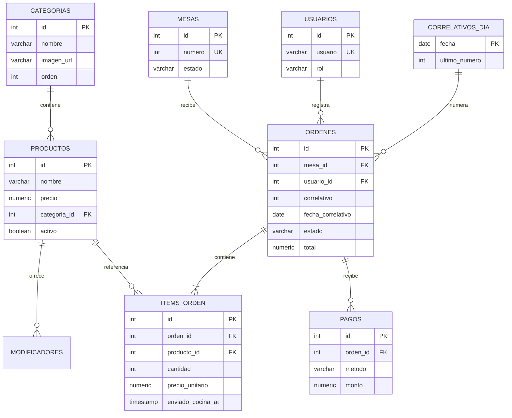

# Modelo de datos

```mermaid
erDiagram
  CATEGORIAS ||--o{ PRODUCTOS : contiene
  PRODUCTOS ||--o{ MODIFICADORES : ofrece
  MESAS ||--o{ ORDENES : recibe
  USUARIOS ||--o{ ORDENES : registra
  ORDENES ||--|{ ITEMS_ORDEN : contiene
  PRODUCTOS ||--o{ ITEMS_ORDEN : referencia
  ORDENES ||--o{ PAGOS : recibe
  CORRELATIVOS_DIA ||--o{ ORDENES : numera

  CATEGORIAS {
    int id PK
    varchar nombre
    varchar imagen_url
    int orden
  }
  PRODUCTOS {
    int id PK
    varchar nombre
    numeric precio
    int categoria_id FK
    boolean activo
  }
  MESAS {
    int id PK
    int numero UK
    varchar estado
  }
  USUARIOS {
    int id PK
    varchar usuario UK
    varchar rol
  }
  ORDENES {
    int id PK
    int mesa_id FK
    int usuario_id FK
    int correlativo
    date fecha_correlativo
    varchar estado
    numeric total
  }
  ITEMS_ORDEN {
    int id PK
    int orden_id FK
    int producto_id FK
    int cantidad
    numeric precio_unitario
    timestamp enviado_cocina_at
  }
  PAGOS {
    int id PK
    int orden_id FK
    varchar metodo
    numeric monto
  }
  CORRELATIVOS_DIA {
    date fecha PK
    int ultimo_numero
  }
```

La combinación `(fecha_correlativo, correlativo)` es única. Además, un índice
parcial impide que una mesa tenga más de una orden abierta simultáneamente.

